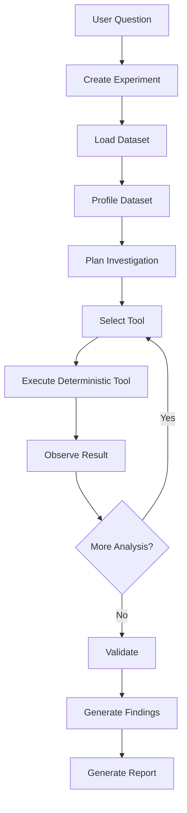
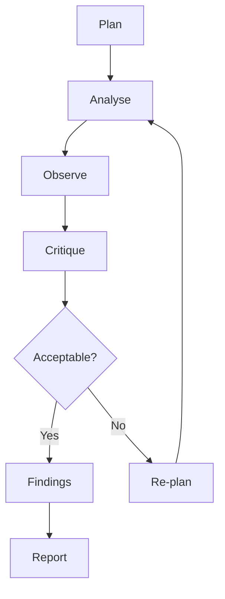

# Agent Workflow

## Initial Single-Agent Workflow

```mermaid
flowchart TD
    A[User Question] --> B[Create Experiment]
    B --> C[Load Dataset]
    C --> D[Profile Dataset]
    D --> E[Plan Investigation]
    E --> F[Select Tool]
    F --> G[Execute Deterministic Tool]
    G --> H[Observe Result]
    H --> I{More Analysis?}
    I -->|Yes| F
    I -->|No| J[Validate]
    J --> K[Generate Findings]
    K --> L[Generate Report]
```

## Iterative Workflow

```mermaid
flowchart TD
    A[Plan] --> B[Analyse]
    B --> C[Observe]
    C --> D[Critique]
    D --> E{Acceptable?}
    E -->|Yes| F[Findings]
    E -->|No| G[Re-plan]
    G --> B
    F --> H[Report]
```

## Limits

The autonomous loop must have explicit limits for:

- Iterations
- Tool calls
- Runtime
- Token usage
- Cost
