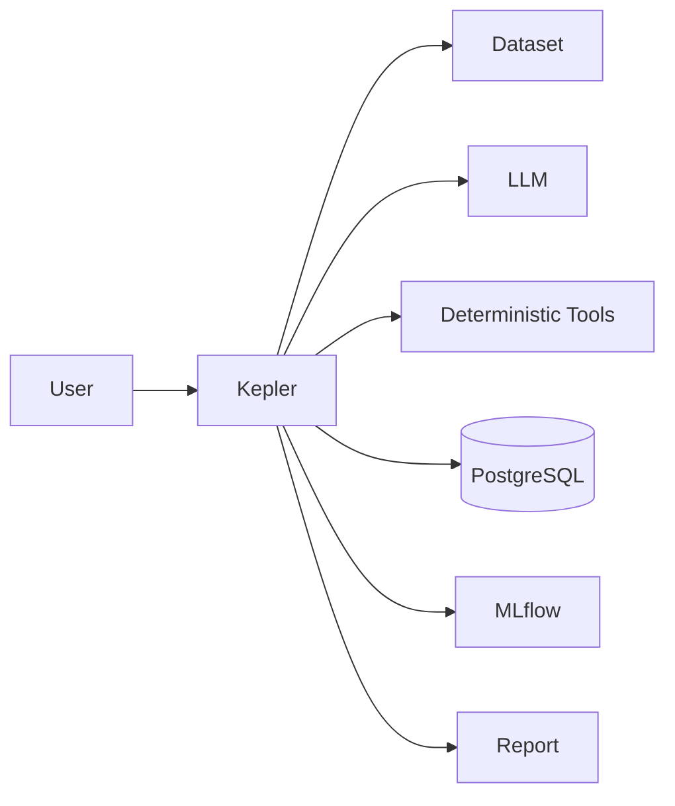

# System Context

## External Systems

### LLM Provider

Provides language-model reasoning.

### Dataset Sources

Provide structured datasets for analysis.

### PostgreSQL

Stores persistent Kepler state.

### MLflow

Stores machine-learning experiment metadata.

### File Storage

Stores datasets and analytical artifacts.

## Boundary

External systems should not become implicit sources of analytical truth.

The deterministic analytical layer remains responsible for calculations.
